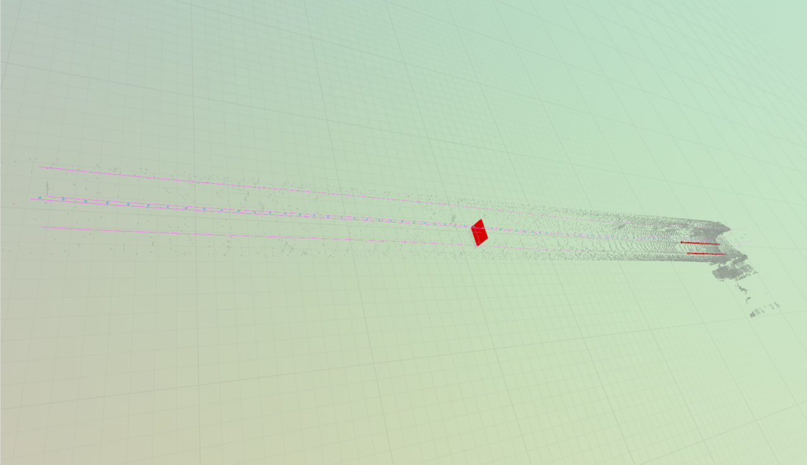
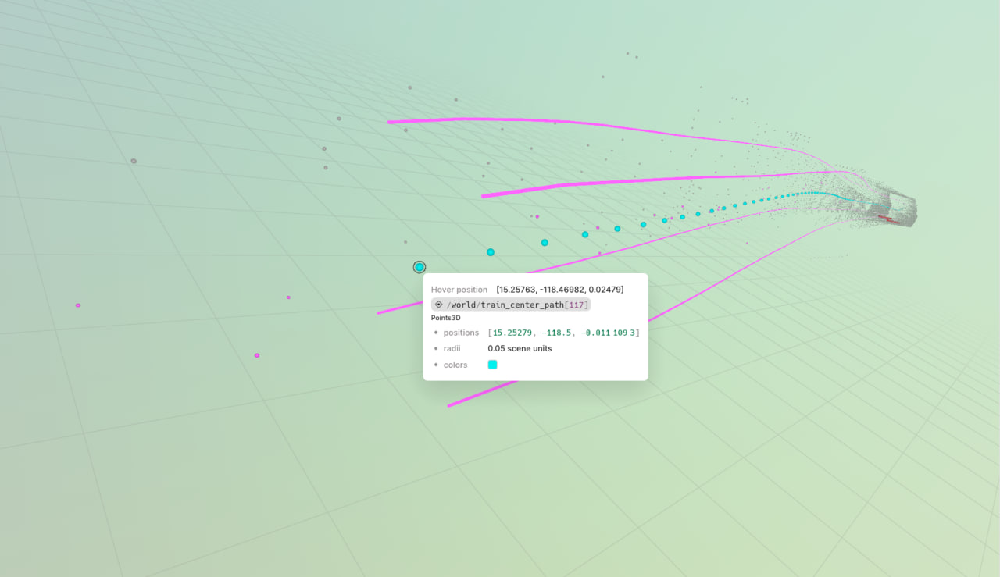
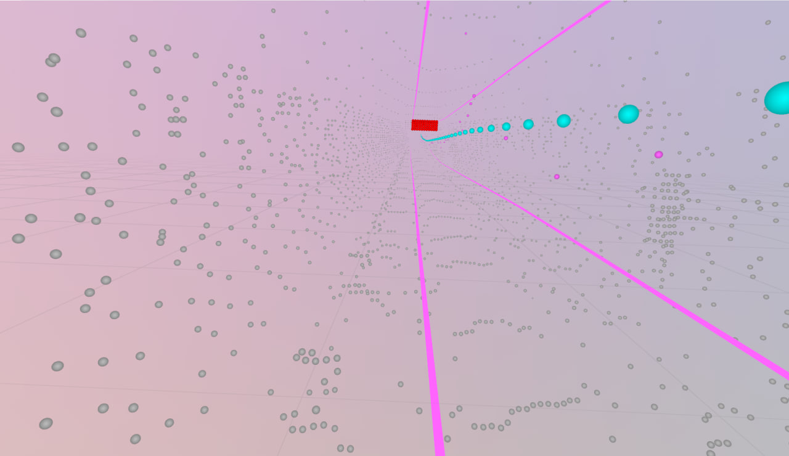
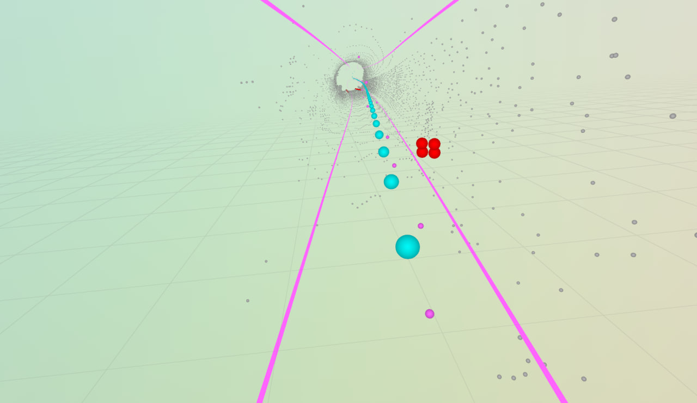

#  Хакатон ЛЦТ 2026 - ДепТранспорта

### Небольшой ROS 2 / Rust-пайплайн для обнаружения посторонних объектов перед поездом метро по данным 3D-лидара. Проект рассчитан на запуск в Docker-контейнере, умеет обрабатывать входное облако точек, публиковать результат обратно в ROS 2 и при необходимости отправлять промежуточную геометрию в Rerun.

<div align="center">


</div>

## Навигация

1. [Быстрый запуск](#1-быстрый-запуск)
2. [Визуализация](#2-визуализация)
3. [Демонстрационные материалы](#3-демонстрационные-материалы)
4. [Технические детали](#4-технические-детали)

---

## 1. Быстрый запуск

### Что нужно на хосте

Для целевого запуска предполагаются Ubuntu 22.04, ROS 2 Humble и Docker. Для GPU-режима дополнительно нужен рабочий NVIDIA Container Toolkit с доступным Vulkan/GPU runtime.

### Запустить приложение одной командой

```bash
docker compose up --build
```

Compose использует `network_mode: host`, поэтому контейнер работает непосредственно в том же ROS 2/DDS network namespace, что и хост.

Второй терминал обычно используется для подачи данных:

```bash
ros2 bag play <path-to-bag> -l
```

Проверить результат можно так:

```bash
ros2 topic echo /lidar/obstacle_detected
ros2 topic echo /lidar/nearest_obstacle_distance
ros2 topic echo /lidar/obstacles
```

### Что публикуется

| Topic | Тип | Содержимое |
|---|---|---|
| `/lidar/obstacles` | `std_msgs/msg/String` | JSON-отчёт по препятствиям текущего кадра |
| `/lidar/obstacle_detected` | `std_msgs/msg/Bool` | Есть ли найденное препятствие |
| `/lidar/nearest_obstacle_distance` | `std_msgs/msg/Float32` | Расстояние до ближайшего препятствия в метрах; при отсутствии используется `ros.no_obstacle_distance` |

### Конфигурация

Основная конфигурация хранится в `settings.json`. Эталонный файл — `settings.json.example`.

Параметры разделены по ответственности:

- `ros` — topics и буфер входного потока;
- `calibration` — ROI и параметры калибровки рельсов;
- `tunnel_path` — поиск центральной траектории тоннеля;
- `train` — габарит и сглаживание;
- `detection` — кластеризация препятствий;
- `numeric` — численные допуски;
- `compute` — CPU/GPU backend;
- `visualize` — Rerun и независимые слои визуализации.

Чтобы использовать другой конфигурационный файл, передайте его первым аргументом приложению:

```bash
./mos_hackathon /path/to/settings.json
```

В контейнере это уже поддерживается через `CMD` и volume `./settings.json:/app/settings.json:ro`.

---

## 2. Визуализация

Визуализация выключается или включается целиком параметром:

```json
"visualize": {
  "enabled": true
}
```

При `enabled = false` Rerun вообще не запускается.

### Что можно включать отдельно

Внутри `visualize` есть независимые флаги:

```json
"visualize": {
  "enabled": true,
  "raw_points": true,
  "roi_boxes": false,
  "calibration": true,
  "train_motion": true,
  "tunnel_center": true,
  "tunnel_center_line": true,
  "train_center_path": true,
  "collisions": true,
  "envelope": true
}
```

Это позволяет, например, оставить только:

- исходное облако;
- найденную ось тоннеля;
- траекторию центра поезда;
- найденные точки пересечения габарита;
- envelope поезда.

### Как подключиться к Rerun

Приложение поднимает локальный gRPC proxy  на стандартном адресе `127.0.0.1:9876`. После запуска контейнера можно подключить Viewer командой:

```bash
rerun --connect rerun+http://127.0.0.1:9876/proxy
```

Это соответствует режиму `serve_grpc`, при котором приложение выступает как gRPC proxy, а Viewer подключается к нему отдельно.

## 3. Демонстрационные материалы









---

## 4. Технические детали

В задачах обработки лидарных данных в метрополитене (особенно в зонах станций, пересадочных узлов или параллельных тоннелей) классические методы поиска центроида сбоят из-за асимметрии точек. Чтобы траектория не «уплывала» в сторону платформ, мы внедрили физическую модель баланса сил на основе экспоненциального потенциального поля. Идея метода Вокруг расчетной оси строится поле стоимости, состоящее из двух конкурирующих компонент: Сила отталкивания - резко возрастает при приближении к объектам, защищая центр от попадания в локальный мусор.Сила притяжения (пружина) - удерживает траекторию вблизи реальных стен обделки.Вклад точек описывается стоимостной функцией от расстояния $r$ до центра:
$$C(r) = \exp\left(\frac{A}{r}\right) + \exp(B \cdot r)$$
Математическая калибровка и связь $A$ и $B$Чтобы центр стабильно удерживался на целевом расстоянии, производная функции стоимости в точке равновесия должна быть равна нулю:
$$\frac{dC}{dr} = -\frac{A}{r^2} \exp\left(\frac{A}{r}\right) + B \exp(B \cdot r) = 0$$
Подставив в это уравнение физический радиус стандартного круглого тоннеля метро $R = 2.55$ м и учитывая масштабные коэффициенты геометрии, получаем соотношение, где $R^4 \approx 40$. Отсюда выводится элегантная и простая связь параметров:
$$A = 40 \cdot B$$

В конце траекторию нужно жестко уровнять. Мы решили взять для этого билинейный сплайн, т.к. он не "штрафует" за повороты и умеет их продолжать.

И этот способ оказалсясамым эффективным, из всех, что мы пробовали. Как видно по демо скриншотам, получается "продлевать" путь на расстояние до 150 метров.

---

